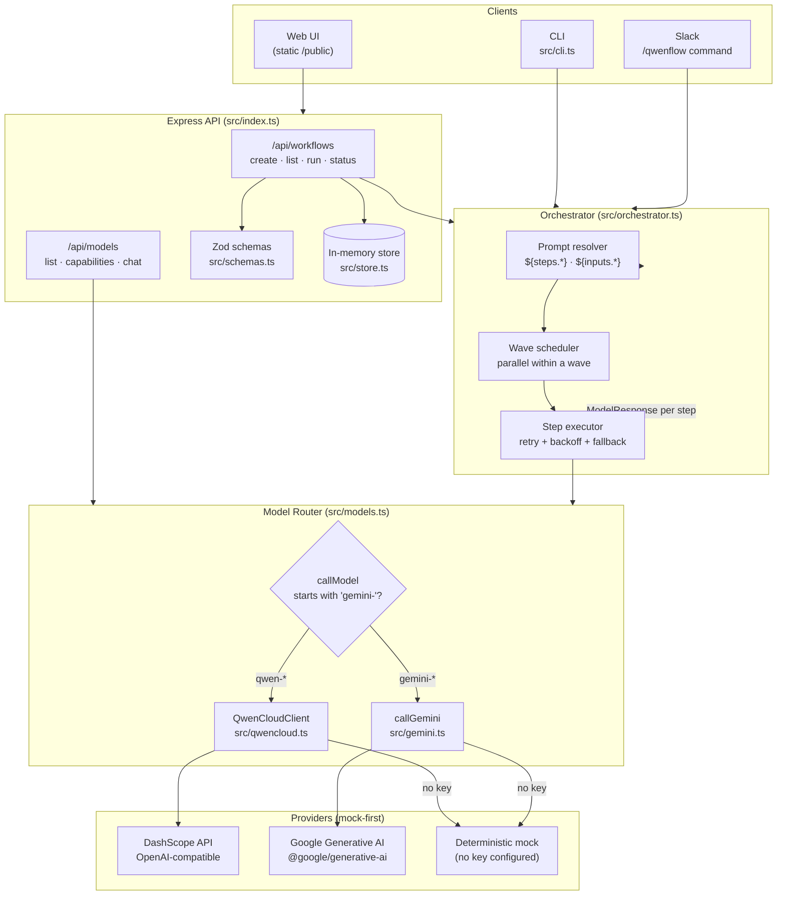

# QwenFlow — Architecture

> Multi-model AI workflow orchestration engine. Define a workflow as a graph of
> steps, route each step to the best model (Qwen or Gemini), and let the
> orchestrator handle parallel scheduling, retries, and failover.

---

## 1. Overview

**QwenFlow** is a TypeScript orchestration engine that lets you compose
heterogeneous AI models — Alibaba's Qwen family (text, vision, audio) and
Google's Gemini family (multimodal) — into reliable, multi-step workflows. You
declare a workflow as a directed acyclic graph (DAG) of *steps*, each pinned to
a specific model. The engine resolves cross-step references, executes
independent steps in parallel, retries transient failures with exponential
backoff, and transparently falls back to a backup model if needed — then
returns a single replayable run object with every step's output, token usage,
and latency.

Everything is **mock-first**: if no API keys are present, every provider
degrades gracefully to deterministic mock responses, so the entire stack boots,
runs, and is fully tested (103 tests) with zero secrets configured. Flip on a
key and the same code talks to real DashScope / Gemini endpoints.

---

## 2. Core Design

The heart of QwenFlow is the [`Orchestrator`](src/orchestrator.ts) — a single
class that turns a static `Workflow` definition into a live, observable
`WorkflowRun`.

### 2.1 Workflows as DAGs

A workflow is a typed object ([`src/types.ts`](src/types.ts)):

```ts
interface Workflow {
  id: string;
  name: string;
  description: string;
  steps: WorkflowStep[];   // the nodes
  edges: WorkflowEdge[];   // declared edges (metadata)
  createdAt: Date;
  status: "draft" | "ready" | "running" | "completed" | "failed";
}
```

Each `WorkflowStep` is one model invocation:

```ts
interface WorkflowStep {
  id: string;
  model: ModelId;            // e.g. "qwen3-32b" or "gemini-2.0-flash"
  prompt: string;            // supports templated references
  temperature?: number;
  maxTokens?: number;
  retryCount?: number;       // retries AFTER the first attempt
  fallbackModel?: ModelId;   // failover target
}
```

> **Dependency inference.** QwenFlow does not require you to hand-wire edges for
> execution. The orchestrator derives each step's *runtime dependencies* by
> scanning its prompt for `${steps.<id>.output}` references. A step becomes
> eligible to run only once every step it references has produced output. This
> keeps workflow definitions declarative and self-consistent.

### 2.2 Prompt resolution (templating)

Before a step runs, the orchestrator resolves two reference types in its prompt
([`resolvePrompt`](src/orchestrator.ts)):

| Reference | Resolves to | Example |
|---|---|---|
| `${steps.<id>.output}` | The completion text of step `<id>` | `Summarize: ${steps.research.output}` |
| `${inputs.<key>}` | A value passed into the run at execution time | `Topic: ${inputs.topic}` |

`${inputs.*}` values are surfaced through the HTTP API body and validated by a
Zod schema ([`src/schemas.ts`](src/schemas.ts)).

### 2.3 Execution model — wave-based scheduling

`run()` executes steps in **dependency-ordered waves**:

```
while not all steps done:
    ready = steps whose dependencies are all satisfied
    if ready is empty → break (cycle or dangling reference, mark run "failed")
    run every step in `ready` concurrently  (Promise.all)
    mark them done, advance progress
```

- Steps with **no inter-dependencies run in parallel** (max concurrency = number
  of ready steps in that wave).
- Steps that **depend on each other run sequentially** (one per wave).
- The loop terminates safely if it ever finds no runnable step before
  completion — i.e. a **dependency cycle** or a **dangling reference** causes a
  clean `"failed"` status rather than an infinite loop or hang. Both cases are
  explicitly unit-tested.

### 2.4 Resilience — exponential backoff + model fallback

Each step is executed by [`executeStep`](src/orchestrator.ts), which implements
two independent layers of fault tolerance:

1. **Exponential backoff retry.** A step tries up to `retryCount + 1` times.
   Between failed attempts it sleeps
   `150 * 2 ** attempt` ms → **150 ms, 300 ms, 600 ms, 1200 ms, …**
2. **Model fallback.** If *every* attempt on the primary `model` fails and a
   `fallbackModel` is defined, the orchestrator transparently re-runs the step
   on the fallback model. Only if both the primary and the fallback fail does
   the step (and its run) propagate the error.

```
attempt 1  → (fail, wait 150ms)
attempt 2  → (fail, wait 300ms)
attempt 3  → (fail) ──► fallbackModel ──► attempt ──► success or hard failure
```

This makes QwenFlow resilient to per-model rate limits and transient provider
outages — a key property for production-grade agent workflows.

### 2.5 The replayable run object

`run()` returns a `WorkflowRun` aggregating the entire execution:

```ts
interface WorkflowRun {
  id, workflowId;
  status: "pending" | "running" | "completed" | "failed";
  currentStep: number;                                  // progress
  results: Record<string, ModelResponse>;               // output per step
  startedAt, completedAt?;
}

interface ModelResponse {
  model: ModelId;
  content: string;
  tokens: { prompt: number; completion: number };
  latency: number;                                      // ms, per step
}
```

Callers (HTTP API, Slack bot, CLI) read token totals and wall-clock duration
straight from this object — no external metrics store required.

### 2.6 Dependency injection for testing

`new Orchestrator(workflow, { callFn })` accepts an optional model caller,
defaulting to the real router in [`models.ts`](src/models.ts). Tests inject a
fake `callFn` to assert scheduling, retry, and fallback behaviour
deterministically without touching any network — this is what makes the 12-test
orchestrator suite fast (sub-second) and hermetic.

---

## 3. Component Diagram



**Data path:** a request enters via a client → the Express API validates it and
hands the `Workflow` to the Orchestrator → the orchestrator resolves templates,
schedules waves, and calls the model router per step → the router dispatches to
the Qwen or Gemini provider (real or mock) → responses stream back up into the
aggregated `WorkflowRun`.

---

## 4. Multi-Model Routing

QwenFlow treats model selection as a **per-step** decision — different steps in
the same workflow can use different models, chosen for the job each step does.

### The router

A single function, [`callModel`](src/models.ts), is the only entry point to any
model:

```ts
export async function callModel(model, prompt, options?): Promise<ModelResponse> {
  if (model.startsWith("gemini-")) return routeToGemini(...);
  return qwenClient.chat(...);          // Qwen / DashScope
}
```

Routing is purely by model-id prefix: any `gemini-*` id goes to the Gemini
client, everything else to the Qwen Cloud client. The same router serves the
orchestrator, the `/api/models/chat` endpoint, and the CLI.

### The model registry

`MODEL_REGISTRY` ([`src/models.ts`](src/models.ts)) declares every model's
capabilities, enabling model-aware workflow authoring and the
`/api/models/:id/capabilities` endpoint:

| Model | Provider | Context | Vision | Audio | Tools |
|---|---|---|---|---|---|
| `qwen3-4b` | Qwen | 32K | – | – | ✓ |
| `qwen3-8b` | Qwen | 64K | – | – | ✓ |
| `qwen3-32b` | Qwen | 128K | – | – | ✓ |
| `qwen-vl` | Qwen | 32K | ✓ | – | ✓ |
| `qwen-audio` | Qwen | 32K | – | ✓ | – |
| `gemini-1.5-flash` | Google | 1M | ✓ | – | ✓ |
| `gemini-1.5-pro` | Google | 2M | ✓ | – | ✓ |
| `gemini-2.0-flash` | Google | 1M | ✓ | – | ✓ |

A workflow can therefore mix capabilities — e.g. a `qwen-vl` step analyzes an
image, feeds its caption into a `qwen3-32b` reasoning step, and a final
`gemini-2.0-flash` step reformats the answer — all within one DAG.

### Failover across providers

Because the router is model-driven and `fallbackModel` is just another
`ModelId`, a step can fail over **across providers** — a Qwen step can fall
back to Gemini (or vice-versa) when its primary model is unavailable.

---

## 5. Integrations

### 5.1 Qwen Cloud / DashScope

[`QwenCloudClient`](src/qwencloud.ts) talks to Alibaba's DashScope gateway using
its **OpenAI-compatible** `/chat/completions` endpoint with `Bearer` token auth.
Model ids are mapped to DashScope names (`qwen-vl` → `qwen-vl-max`,
`qwen-audio` → `qwen-audio-turbo`). The key is read from
`QWEN_CLOUD_API_KEY` or `DASHSCOPE_API_KEY`; with neither set, `chat()`
returns a deterministic mock so the system runs key-free. `validate()`
introspects configured state.

### 5.2 Gemini

[`callGemini`](src/gemini.ts) uses the official `@google/generative-ai` SDK,
honoring `temperature` and `maxTokens`. Without `GEMINI_API_KEY` it returns a
mock response; on a real API error it throws a typed error that the
orchestrator's retry/fallback logic handles.

### 5.3 Slack

A [`@slack/bolt`](https://slack.dev/bolt/) integration
([`src/slack.ts`](src/slack.ts), [`src/slack-commands.ts`](src/slack-commands.ts))
exposes a single `/qwenflow` slash command with three subcommands:

| Command | Action |
|---|---|
| `/qwenflow run <id>` | Execute a stored workflow and post the result (steps, tokens, latency) |
| `/qwenflow status [id]` | List all workflows, or inspect one |
| `/qwenflow models` | List available models |

It runs over **Socket Mode** when `SLACK_APP_TOKEN` is present, or HTTP via an
`ExpressReceiver` otherwise. Entry point [`src/slack-start.ts`](src/slack-start.ts)
boots the HTTP server and lazily mounts Slack only if `SLACK_BOT_TOKEN` is set.

---

## 6. Data Flow — End-to-End Example

A representative run: a three-step research workflow where step 2 depends on
step 1.

```yaml
workflow: research-summary
inputs: { topic: "Qwen3 architecture" }
steps:
  - id: research     model: qwen3-32b   prompt: "Gather facts about ${inputs.topic}"
  - id: analyze      model: qwen3-8b    prompt: "Find key insights in: ${steps.research.output}"
  - id: headline     model: gemini-2.0-flash  prompt: "Write a headline for: ${steps.analyze.output}"
```

1. **Ingest.** `POST /api/workflows/:id/run` body `{ inputs: { topic: "…" } }`
   is validated by Zod (`RunWorkflowSchema`).
2. **Build run.** The route loads the `Workflow` from the store and constructs
   `new Orchestrator(workflow, { inputs })`.
3. **Schedule.** `run()` computes dependencies:
   - `research` → no deps → **wave 1**
   - `analyze` → depends on `research` → **wave 2**
   - `headline` → depends on `analyze` → **wave 3**
4. **Wave 1.** Resolve `research`'s prompt (no refs) → `callModel("qwen3-32b", …)`
   → DashScope (or mock) → store `results.research`.
5. **Wave 2.** Resolve `analyze`'s prompt, substituting
   `${steps.research.output}` → invoke model → store `results.analyze`.
6. **Wave 3.** Resolve `headline`'s prompt with `analyze`'s output → routed to
   Gemini → store `results.headline`.
7. *(Failure path)* If any step's model threw, `executeStep` would retry with
   backoff (150→300→600ms) and, if still failing, try `fallbackModel`.
8. **Aggregate.** All results collected → `status: "completed"`,
   `completedAt` set. The full `WorkflowRun` (every step's content + tokens +
   latency) is returned as the HTTP response and, via Slack, posted back to the
   channel.

```
research (qwen3-32b) ──► analyze (qwen3-8b) ──► headline (gemini-2.0-flash)
   wave 1                  wave 2                 wave 3
```

---

## 7. Testing

QwenFlow ships with **103 passing tests across 10 suites**
(`npm test`, Vitest), covering every layer from the model router to the HTTP
API. The suite is hermetic — it never hits the network, thanks to the injected
`callFn` and mock-first providers.

| # | Suite | Tests | Covers |
|---|---|---:|---|
| 1 | `routes` | 29 | Zod schema validation — `ModelIdSchema`, `WorkflowStepSchema`, `CreateWorkflowSchema`, `RunWorkflowSchema`: acceptance, rejection, and enum / range / length boundaries (incl. the 20-step cap and 200-char name limit) |
| 2 | `gemini` | 13 | Gemini model registry, `listGeminiModels` shape, mock-mode `callGemini` (model name, token count, prompt truncation, options passthrough) |
| 3 | `orchestrator` | 12 | DAG execution, `${steps.*}` / `${inputs.*}` resolution, parallel vs sequential scheduling, cycle & dangling-ref safety, **exponential-backoff retry**, **model fallback**, progress tracking |
| 4 | `slack` | 12 | Bolt app init, command parsing, `/qwenflow run` / `status` / `models` handler behaviour |
| 5 | `schemas` | 11 | `WorkflowStep` / `CreateWorkflow` / `ModelId` validation, temperature (0–2) & maxTokens (1–32768) ranges, defaults |
| 6 | `api` | 5 | End-to-end Express app: `/health`, workflow create (incl. rejection of bad input), model listing, run execution |
| 7 | `qwencloud` | 7 | DashScope client construction (explicit/env/no-key), model-id mapping, mock fallback, configured-state introspection |
| 8 | `cli` | 5 | `parseArgs` for commands and `--model` / `--prompt` / `--name` options, boolean flags, defaults |
| 9 | `types` | 5 | Model registry (all 8 models, 5 Qwen + 3 Gemini), capability contracts, workflow/step structural guarantees |
| 10 | `store` | 4 | In-memory workflow store CRUD (get/set/delete/list) |

```
Test Files  10 passed (10)
     Tests  103 passed (103)
```

Two suites anchor correctness from opposite ends: **`routes`/`schemas`** (40
tests combined) lock down every malformed-input path that can reach the API,
while the **`orchestrator`** suite proves the engine itself runs independent
steps concurrently, sequences dependent ones, retries transient failures with
backoff, falls back across models, and never hangs on malformed graphs.

---

## 8. Design Principles

- **Mock-first.** Every provider degrades to a deterministic mock with no key.
  The whole system runs and is fully tested with zero secrets.
- **Declarative DAGs.** Declare steps and reference each other; the engine
  infers the execution order — no manual edge bookkeeping.
- **Resilience by default.** Per-step `retryCount` (exponential backoff) +
  `fallbackModel` (cross-provider failover) are first-class step properties.
- **Single routing seam.** One `callModel` function is the only path to any
  model, keeping the orchestrator decoupled from provider specifics.
- **Observable runs.** Token usage and latency are captured per step and
  surfaced in the run object, so cost/performance is visible with no extra
  instrumentation.
- **Hackathon-grade store, production-aware design.** Workflows live in an
  in-memory store for the process lifetime; the codebase is structured so a
  Redis/SQLite backend is a drop-in replacement (see `src/store.ts`).
