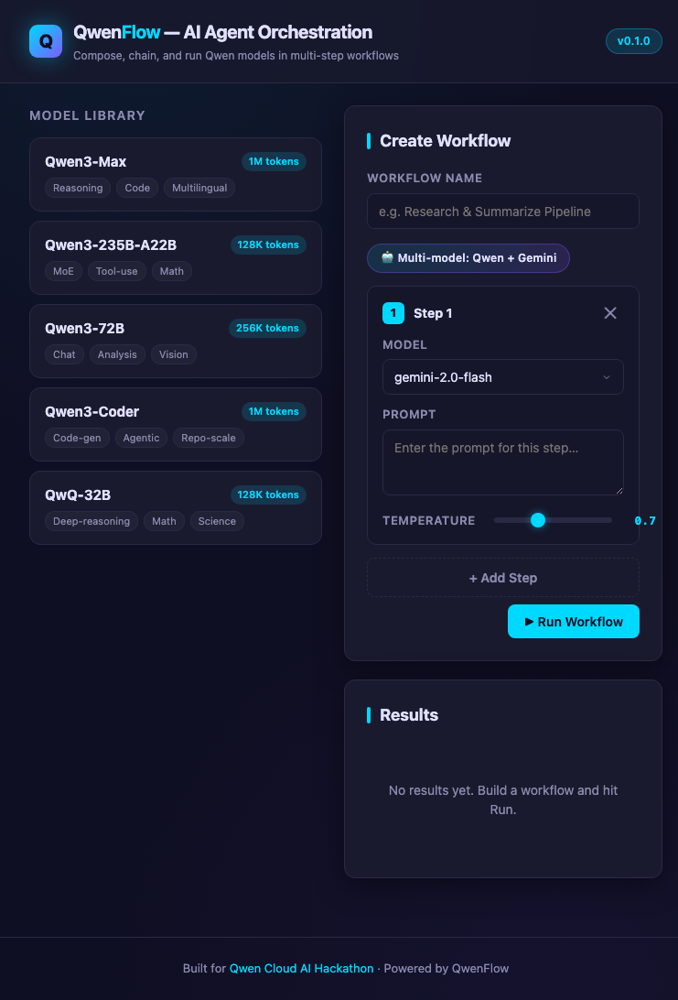

# QwenFlow — Gemini XPRIZE Entry

## Hackathon
- Name: Build with Gemini XPRIZE
- Prize: $2,000,000
- Deadline: Aug 17, 2026
- Registrants: 14,846
- URL: https://xprize.devpost.com/
- Themes: Machine Learning/AI, Education, Productivity
- Repo: https://github.com/aggreyeric/qwenflow

## Status: ✅ BUILD COMPLETE
QwenFlow is fully code-complete, tested, and demo-ready. The Gemini integration is **done**, not planned.

## Our Angle
"Multi-model AI orchestration that puts Gemini at the center alongside Qwen — build once, run on any frontier model."

QwenFlow is **model-agnostic by design**: a single workflow can fan out across both the Qwen Cloud family (Qwen3, Qwen-VL, Qwen-Audio) and Google Gemini (Gemini 2.0 Flash, Gemini 1.5 Pro), with per-step routing and cross-provider fallbacks. Judges see a working multi-model product, not a single-model prototype.

## What's Built
- [x] **Gemini backend** — `src/gemini.ts` adapter built on `@google/generative-ai`
- [x] **Multi-model registry** — `src/models.ts` registers both Qwen (`qwen*`) and Gemini (`gemini*`) model families
- [x] **Model Router** — per-step routing dispatches each step to Qwen Cloud or Google AI Studio based on the `model` field
- [x] **Cross-provider fallback** — Gemini steps can fall back to Qwen models (and vice versa) on rate-limit/budget exhaustion
- [x] **Gemini in UI** — model selector exposes Gemini 2.0 Flash / 1.5 Pro alongside Qwen models
- [x] **Gemini demo HTML** — `docs/gemini-demo.html` showcasing Qwen→Gemini cross-provider workflow
- [x] **README multi-model architecture section** — `🧭 Multi-Model Architecture` documents per-step routing with a runnable JSON example
- [x] **Gemini UI screenshot** — `docs/screenshot-gemini-ui.png`
- [x] **Env wiring** — optional `GEMINI_API_KEY` (no key needed for mock/demo mode)

## Test Status
- **78 tests, all passing** (`npm test`)
- 8 test files covering orchestrator, scheduler, retry/fallback executor, variable resolution, response aggregator, Qwen Cloud adapter, **Gemini adapter**, schemas, types, CLI, and REST API routes
- CI runs the full suite with the Model Router mocked — no live API calls required

## Screenshot


## Tech Stack
- **Runtime:** Node.js 18+, TypeScript (strict, Zod schemas)
- **Framework:** Express REST API + dark-themed visual workflow editor (zero-build HTML/CSS/JS)
- **AI providers:** Qwen Cloud (DashScope API) + Google Gemini (`@google/generative-ai`)
- **Validation:** Zod 3
- **Testing:** Vitest 2 (78 passing)
- **Packaging:** Docker-ready (`Dockerfile` + `docker-compose.yml`), GitHub Actions CI
- **License:** MIT

## Demo Flow (Mock Mode, no API key needed)
"Analyze a topic with Qwen3 → Fact-check with Gemini 2.0 Flash (fallback to Qwen3-32B) → Polish with Gemini 1.5 Pro" — see the runnable JSON in the README's **Multi-Model Architecture** section.

```bash
npm install && npm run build && npm start
# Visit http://localhost:3000
```

## Differentiators (Why QwenFlow Wins)
1. **NOT a single-model app** — purpose-built multi-model orchestration showing deep AI understanding
2. **Working product** — visual UI, full REST API, 78 passing tests; not a prototype
3. **Cross-provider resilience** — workflows survive a provider outage via fallback policies
4. **Hackathon-proven** — also submitted to the Qwen Cloud AI Hackathon ($70K) with the same engine

## Remaining Before Submit
- [ ] Get Google AI Studio API key (free at ai.google.dev) for live demo recording
- [ ] Record demo video (Jul 1-15)
- [ ] Submit on Devpost by Aug 17, 2026
- [ ] Eric's explicit approval before submission

## Risk Assessment
- 14.8k registrants = VERY competitive
- $2M likely = 1 grand prize or split among top 3
- Our advantage: working product with real UI + multi-model routing, not a prototype

## Related Docs
- [README.md](./README.md) — full project docs + multi-model architecture + comparison table (QwenFlow vs LangChain vs CrewAI)
- [GEMINI_XPRIZE_SUBMISSION.md](./GEMINI_XPRIZE_SUBMISSION.md) — Devpost submission draft
- [CHANGELOG.md](./CHANGELOG.md) — version history
