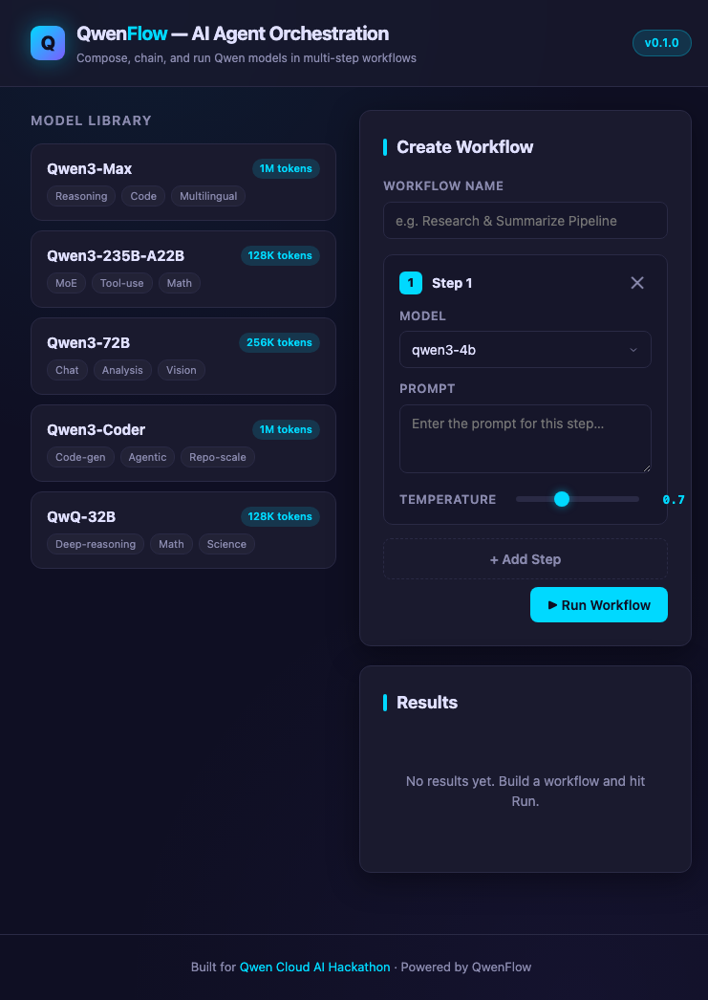

# QwenFlow 🌊

       

## 📸 Screenshot



*QwenFlow orchestrates multi-step AI workflows using multi-model orchestration across Qwen Cloud and Google Gemini.*

> Multi-model AI agent orchestration framework combining Qwen Cloud and Google Gemini — chain Qwen and Gemini model calls into intelligent workflows with retry, fallback, and observability.

QwenFlow turns the Qwen Cloud and Google Gemini model families into **composable building blocks**. Instead of writing one-off API calls, you declare a workflow — a directed graph of model steps — and QwenFlow handles execution, retries, fallbacks, and live observability for you.

Most agent frameworks are model-agnostic to a fault. QwenFlow goes the other way: it is opinionated about Qwen's multi-model strengths (Qwen3 for reasoning, Qwen-VL for vision, Qwen-Audio for speech) so you can build pipelines that actually exploit them.

---

## 💡 Why QwenFlow?

- **Qwen Cloud is Alibaba's serverless AI platform but lacks a developer-friendly orchestration layer.** You get powerful raw model endpoints, but no way to compose them into pipelines.
- **QwenFlow fills that gap:** chain multiple Qwen models (text, vision, audio) into executable workflows that handle scheduling, retries, and fallbacks for you.
- **Unlike LangChain/LangGraph, QwenFlow is purpose-built for Qwen Cloud's multi-model strengths** — it knows about Qwen3, Qwen-VL, and Qwen-Audio natively rather than treating models as interchangeable black boxes.
- **Zero external LLM dependencies** — runs in mock mode for local development, then connects to the Qwen Cloud API for production. No vendor lock-in to a third orchestrator.
- **Visual workflow builder included** — a dark-themed, no-build-step drag-and-drop canvas for designing and debugging pipelines before they ever touch the API.

### How QwenFlow compares

QwenFlow is the easiest way to build multi-step AI agent pipelines — a beautiful dark-themed visual editor, zero-configuration Docker setup, and a full REST API, purpose-built for multi-model orchestration with Qwen Cloud and Gemini.

| Feature | QwenFlow | LangChain | CrewAI |
|---------|----------|-----------|--------|
| Multi-model orchestration | ✅ Qwen + Gemini | ✅ Any LLM | ✅ Any LLM |
| Visual workflow editor | ✅ Dark UI | ❌ Code only | ❌ Code only |
| Zero-config setup | ✅ Docker one command | ❌ Complex deps | ❌ Complex deps |
| REST API | ✅ Full CRUD | ❌ Python only | ❌ Python only |
| Zod validation | ✅ Type-safe schemas | ⚠️ Pydantic | ⚠️ Basic |
| Open source | ✅ MIT | ✅ MIT | ✅ MIT |
| Hackathon-ready | ✅ Demo + Screenshots | ❌ | ❌ |

---

## ✨ Features

- **Visual workflow builder** — drag-and-drop model chaining, with the full graph serializable to/from JSON
- **Multi-model orchestration** — Qwen3, Qwen-VL, Qwen-Audio, and Google Gemini (Gemini 2.0 Flash, Gemini 1.5 Pro) in a single workflow, each step routed to the right model
- **Smart retry** — exponential backoff with automatic model fallback when a step exceeds its budget or rate limit
- **Real-time execution observability** — per-step status, latency, token usage, and cost streamed live
- **Zero-config local development** — reads `DASHSCOPE_API_KEY` from the environment, no setup wizard
- **TypeScript-first** — full type safety on workflow definitions, inputs, and outputs via Zod schemas

---

## 💬 Slack Integration

QwenFlow integrates with Slack via `/qwenflow` slash commands:

| Command | Description |
|---------|-------------|
| `/qwenflow run <id>` | Run a workflow, get result in thread |
| `/qwenflow status [id]` | List all workflows or check one |
| `/qwenflow models` | Show available AI models |

Setup:
1. Create a Slack App at api.slack.com/apps
2. Enable slash commands, add `/qwenflow`
3. Set env vars: `SLACK_BOT_TOKEN`, `SLACK_SIGNING_SECRET`, `SLACK_APP_TOKEN`
4. The integration uses Socket Mode — no public URL needed

Built for the [Slack Agent Builder](https://devpost.com/slack-agent-builder) hackathon ($42K).

---

## 🚀 Quick Start

### Prerequisites
- Node.js 18+
- npm or yarn
- Optional: Qwen Cloud API key (DashScope) for real AI inference

### Install & Run
```bash
git clone https://github.com/aggreyeric/qwenflow.git
cd qwenflow
npm install
npm run build
npm start
```

The server starts at http://localhost:3000. To enable **Gemini** models alongside Qwen, export the Google AI Studio key:

```bash
export GEMINI_API_KEY=your-google-ai-studio-key   # optional — enables Gemini routing
```

| Command              | Description                       |
| -------------------- | --------------------------------- |
| `npm run dev`        | Dev server with hot reload (tsx)  |
| `npm run typecheck`  | Type-check only, no emit          |
| `npm test`           | Run the Vitest suite once         |
| `npm run test:watch` | Run tests in watch mode           |

### With Docker
```bash
docker compose up --build
```

### Demo (Mock Mode)
No API key needed — the mock fallback simulates Qwen Cloud responses:
```bash
npm start
# Then visit http://localhost:3000 or use the CLI:
node dist/cli.js run --name "test" --prompt "Hello"
```

### Environment Variables
| Variable | Required | Default | Description |
|----------|----------|---------|-------------|
| PORT | No | 3000 | Server port |
| DASHSCOPE_API_KEY | No | — | Qwen Cloud/DashScope API key |
| GEMINI_API_KEY | No | — | Google AI Studio API key (optional, enables Gemini models) |

---

## 🤖 Slack Integration

QwenFlow includes a Slack bot that lets teams run workflows from chat.

### Setup
1. Create a Slack App at https://api.slack.com/apps
2. Enable Slash Commands, add `/qwenflow`
3. Set env vars: `SLACK_BOT_TOKEN`, `SLACK_SIGNING_SECRET`, `SLACK_APP_TOKEN`
4. Start QwenFlow — Slack auto-initializes when token is present

### Commands
| Command | Description |
|---------|-------------|
| `/qwenflow run <name>` | Run a workflow |
| `/qwenflow status <name>` | Check workflow progress |
| `/qwenflow models` | List available Qwen models |
| `/qwenflow list` | List all registered workflows |

---

## 🏗️ Architecture

QwenFlow is a pipeline-oriented orchestrator. A **workflow** is a DAG of **steps**; each step names a Qwen model, a prompt template, and an optional retry/fallback policy. Execution flows through five layers:

1. **Qwen Cloud API** — the underlying DashScope-compatible model endpoints (Qwen3, Qwen-VL, Qwen-Audio).
2. **QwenFlow Orchestrator** — owns the workflow graph, schedules steps in dependency order, and resolves variable references between steps (e.g. `${steps.analyze.output}`).
3. **Model Router** — maps each step's `model` field to the correct Qwen Cloud endpoint and serializes the request (text, image, or audio payload).
4. **Step Executor** — runs a single step with its retry policy: exponential backoff on transient failures, automatic fallback to a cheaper/different model when configured.
5. **Response Aggregator** — collects each step's output, tokens, latency, and cost into a single trace you can inspect or replay.

```
                        ┌─────────────────────────┐
                        │      Qwen Cloud API      │
                        │  (Qwen3 / Qwen-VL /      │
                        │       Qwen-Audio)        │
                        └────────────▲────────────┘
                                     │ HTTPS
                        ┌────────────┴────────────┐
                        │      Model Router        │
                        │  endpoint + payload mux  │
                        └────────────▲────────────┘
                                     │
   ┌─────────────────┐    ┌──────────┴────────────┐    ┌─────────────────────┐
   │  Workflow JSON  │───▶│  QwenFlow Orchestrator │───▶│   Step Executor     │
   │  (DAG of steps) │    │  schedule + resolve    │    │  retry + fallback   │
   └─────────────────┘    └──────────┬────────────┘    └──────────┬──────────┘
                                     │                            │
                                     └────────────┬───────────────┘
                                                  ▼
                                     ┌─────────────────────────┐
                                     │  Response Aggregator     │
                                     │  outputs · tokens ·      │
                                     │  latency · cost · trace  │
                                     └─────────────────────────┘
```

**Why this shape?** Keeping routing, execution, and aggregation in separate layers means you can swap the Model Router for a local model, or replace the Aggregator with an OpenTelemetry exporter, without touching the orchestrator's core scheduling logic.

---

## 🧭 Multi-Model Architecture

The **Model Router** inspects each step's `model` field and dispatches to the right provider: `qwen*` models go to the DashScope (Qwen Cloud) endpoint, and `gemini*` models go to the Google AI Studio endpoint. Because routing is per-step, a single workflow can fan out across both families — Qwen3 for reasoning, Gemini 2.0 Flash for fast multimodal calls — with fallbacks that can cross provider boundaries.

```json
{
  "name": "qwen-gemini-router",
  "steps": [
    {
      "id": "reason",
      "model": "qwen3-72b-instruct",
      "prompt": "Outline the key arguments for: ${inputs.topic}"
    },
    {
      "id": "flash",
      "model": "gemini-2.0-flash",
      "prompt": "Summarize and fact-check this outline:\n${steps.reason.output}",
      "fallback": "qwen3-32b-instruct"
    },
    {
      "id": "finalize",
      "model": "gemini-1.5-pro",
      "prompt": "Produce a polished 3-paragraph brief from:\n${steps.flash.output}"
    }
  ],
  "output": "${steps.finalize.output}"
}
```

Here `reason` runs on Qwen3, `flash` on Gemini 2.0 Flash (falling back to a Qwen model if Gemini is rate-limited), and `finalize` on Gemini 1.5 Pro — all coordinated by one orchestrator with a unified trace.

---

## 📊 Workflow Example

Workflows are plain JSON — version them, diff them, and share them. Here's a **multimodal sentiment-analysis pipeline**: Qwen3 classifies the text, Qwen-VL inspects an attached image for visual sentiment cues, and Qwen3 fuses both into a final summary.

```json
{
  "name": "multimodal-sentiment",
  "version": "1.0.0",
  "inputs": {
    "text":  { "type": "string" },
    "image": { "type": "image-url" }
  },
  "steps": [
    {
      "id": "analyze-text",
      "model": "qwen3-72b-instruct",
      "prompt": "Classify the sentiment of this text as positive, neutral, or negative. Explain in one sentence.\n\nText: ${inputs.text}",
      "retry": { "maxAttempts": 3, "backoffMs": 500, "factor": 2 }
    },
    {
      "id": "analyze-image",
      "model": "qwen-vl-max",
      "prompt": "Describe the emotional tone of this image in one sentence.",
      "image": "${inputs.image}",
      "fallback": "qwen-vl-plus"
    },
    {
      "id": "summarize",
      "model": "qwen3-72b-instruct",
      "prompt": "Combine the text sentiment and image tone into a single brand-safety verdict (safe / review / block) with a one-line rationale.\n\nText sentiment: ${steps.analyze-text.output}\nImage tone: ${steps.analyze-image.output}"
    }
  ],
  "output": "${steps.summarize.output}"
}
```

Run it:

```bash
npx qwenflow run ./workflows/sentiment.json \
  --input text="The new update broke everything 😡" \
  --input image="https://example.com/screenshot.png"
```

QwenFlow executes `analyze-text` and `analyze-image` in parallel (they share no dependencies), waits for both, then runs `summarize`. The returned trace shows per-step latency, token counts, and which (if any) fallback model was used.

---

## 🧪 Testing

The suite uses [Vitest](https://vitest.dev/) and covers the orchestrator's scheduler, the retry/fallback executor, variable resolution, and the response aggregator. No live Qwen Cloud calls are made in CI — the Model Router is mocked.

```bash
npm test          # one-shot
npm run test:watch
```

---

## 🏆 Built For

| Hackathon | Prize Pool | Our Angle |
|-----------|-----------|-----------|
| **Qwen Cloud AI Hackathon** | $70K | Multi-model orchestration + developer tooling across Qwen3, Qwen-VL, and Qwen-Audio |
| **Gemini XPRIZE** | $2M | Cross-provider routing that pairs Gemini's multimodal speed with Qwen's reasoning depth |

---

---

## 🏆 Other Projects by aggreyeric

| Project | Description | Prize |
|---------|-------------|-------|
| [ZeroDeploy](https://github.com/aggreyeric/h0-zerostack) | GitHub repo quality scorer | $80K |
| [Casper Forge](https://github.com/aggreyeric/casper-forge-x402) | x402 payment protocol for Casper | $150K |
| [Veritas ZK](https://github.com/aggreyeric/veritas-zk) | Zero-knowledge credential verifier | $10K |
| [BNB Market Regime](https://github.com/aggreyeric/bnb-market-regime-oracle) | BTC regime classifier | $36K |
| [Tether QVAC Solace](https://github.com/aggreyeric/tether-qvac-solace) | Mental health companion | $21K |
| [BLI Compliance](https://github.com/aggreyeric/bli-compliance-agent) | Legal compliance agent | $50K |

## License

MIT © QwenFlow Contributors

## 🤖 AI Assistants

→ See [CLAUDE.md](./CLAUDE.md) for AI coding assistant context.
